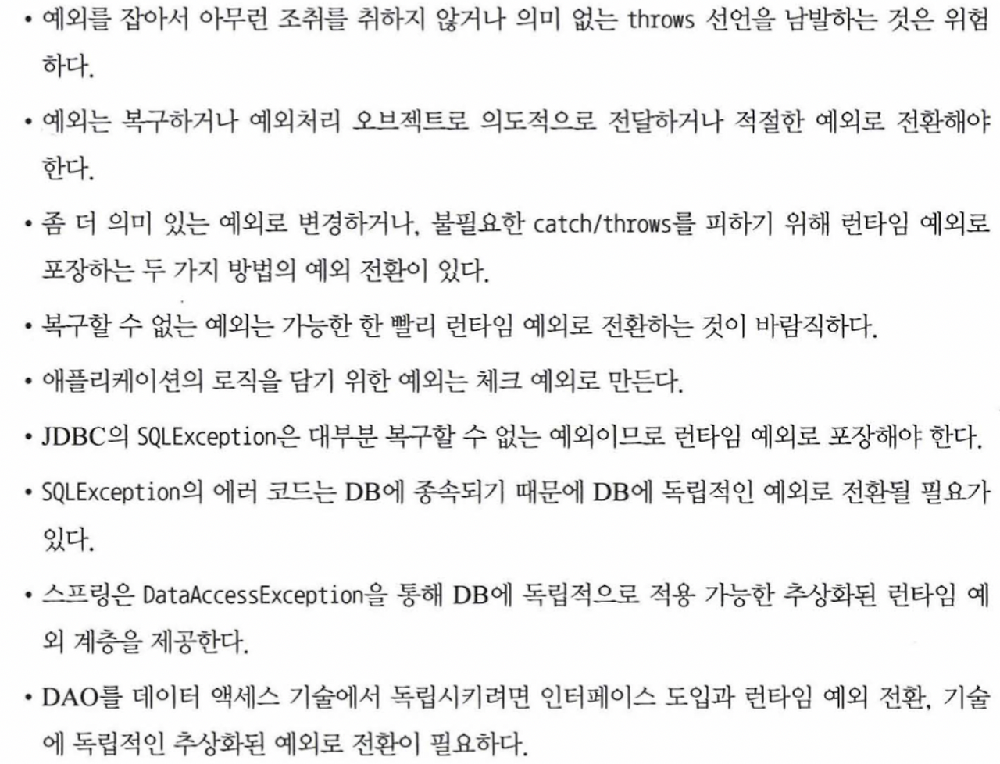

# Chapter 4 예외

SQLException은 코드 레벨에서 복구할 수 있는 방법인가?

→ 99%의 SQLException은 코드에서 복구할 방법이 없다.

그렇기 때문에 가능한 빨리 런타임 예외로 전환해줘야 한다. 스프링의 JdbcTemplate은 템플릿과 콜백 안에서 발생하는 모든 SQLException을 런타임 예외인 DataAccessException으로 포장해서 던져준다. 따라서 꼭 필요한 경우에만 DataAccessException을 잡아서 처리하면 되고 그 외의 경우에는 무시해도 된다.

애플리케이션 레벨에서 신경 쓰지 않기 위함
SQLException에 담긴 다루기 힘든 상세한 예외정보를 의미 있고 일관성 있는 예외로 전환해서 추상화 하기 위함

